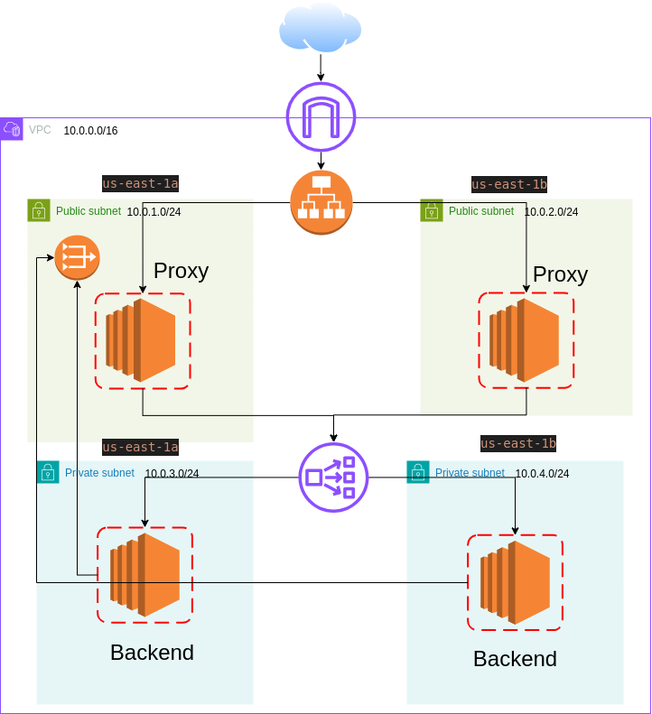

# Terraform-ALB-to-NLB-Public-Private-Arch
This project implements a public-private architecture on AWS using Terraform. It uses an Application Load Balancer (ALB) for public-facing traffic, which redirects requests to a public EC2S which redirect requests to a Network Load Balancer (NLB) for private resources, such as EC2 instances hosted in a Virtual Private Cloud (VPC). The infrastructure is designed to be highly available and scalable.
<p align="center">
  
</p>

## Prerequisites
 1. Terraform 1.0 or later installed.
 2. AWS account with necessary IAM permissions.
 3. Basic understanding of AWS networking and Terraform

## Project Structure
``` sh 
.
├── main.tf                      # Main entry point for the infrastructure definition
├── nginx.conf                   # NGINX configuration for EC2 instances
├── output.tf                    # Defines the output variables from the deployment
├── provider.tf                  # AWS provider and authentication setup and Global configuration for the project (e.g., backend settings)
├── values.auto.tfvars           # Default values for input variables
├── variables.tf                 # Defines input variables used in the project
├── EC2_module/                  # EC2 instance resources
│   ├── main.tf                  # EC2 instance definitions
│   ├── outputs.tf               # Outputs specific to EC2 instances (e.g., instance IDs)
│   └── variables.tf             # Variables specific to EC2 instances (e.g., AMI ID, instance type)
├── VPC_module/                  # VPC and network resources
│   ├── main.tf                  # VPC creation, subnets, internet gateway, route tables
│   ├── outputs.tf               # Outputs related to VPC (e.g., subnet IDs, VPC ID)
│   └── variables.tf             # Variables for VPC settings (e.g., CIDR blocks)
├── loadbalancer/                # Load Balancer resources (ALB and NLB)
│   ├── main.tf                  # ALB and NLB definitions, listener rules, target groups
│   ├── output.tf                # Output values for the load balancer (e.g., DNS name)
│   └── variable.tf              # Variables for the load balancer module (e.g., ports, target groups)
└── .gitignore                   # Git ignore file for untracked files (e.g., state files)
 ```
## Detailed File Description
1. main.tf : This is the core of the Terraform configuration. It orchestrates the creation of all resources, including the VPC, subnets, load balancers, security groups, and EC2 instances. The resources defined here are modularized across different files but combined in this file for easy access and deployment.
2. nginx.conf : A configuration file for the NGINX web server running on EC2 instances, which handles forwarding of the requstes to the network load balancer and serves traffic directed by the Application load balancer.
3. output.tf : Specifies the values to be displayed after the infrastructure is deployed. These outputs typically include information like the ALB DNS name, EC2 instance IDs, and VPC IDs.
4. provider.tf : Configures the AWS provider, enabling Terraform to communicate with AWS services. The provider configuration may include the AWS region and access credentials.it also contains Global configuration for the project (e.g., backend settings)
5. values.auto.tfvars : This file contains default values for the input variables defined in variables.tf. It allows you to store commonly used settings (like instance type, AMI ID, etc.) so you don't need to pass them each time you run terraform apply.
6. variables.tf : Defines the input variables used throughout the project. This file allows users to parameterize the Terraform configuration, making it flexible and reusable for different environments.

## Modules
- EC2 Module (EC2_module/) : This module is responsible for creating EC2 instances. The main.tf file in this folder defines the EC2 instances' configuration, including their size, AMI ID, and security groups. Outputs like instance IDs are captured in outputs.tf.

- VPC Module (VPC_module/) : This module handles VPC creation, including subnets, route tables, and the internet gateway. This modular approach enables better reuse across different projects. The main.tf defines the network resources, and the outputs.tf captures relevant information like VPC ID and subnet IDs.

- Load Balancer Module (loadbalancer/) : This module defines both the ALB (public-facing) and NLB (private-facing) load balancers. It sets up listeners, target groups, and integrates with EC2 instances.
## Resources Created
1. VPC
   - Public and private subnets
   - Route tables and internet gateway

2. Application Load Balancer (ALB)
   - Handles incoming public traffic
   - Listeners and target groups to route requests to private EC2 instances via NLB
3. Network Load Balancer (NLB)
   - Balances traffic between internal EC2 instances
4. EC2 Instances
   - Hosts application servers (NGINX)
   - Hosts application servers (HTTPd)
5. Security Groups
   - Manage inbound and outbound traffic rules for ALB, NLB, and EC2 instances
## Remote State File
Terraform uses a state file to keep track of your AWS resources. In this project, the state is stored remotely using an S3 bucket . Remote state ensures collaboration between team members, as it avoids local state file conflicts.
-Benefits of Remote State
   1. Consistency: All team members work with the same state file, avoiding discrepancies.
   2. Collaboration: Multiple users can make changes safely.
   3. Locking: When using backends like S3 with DynamoDB for locking, Terraform prevents concurrent operations, ensuring that state changes are applied correctly
## Usage
1. Clone the Repository
```sh
git clone https://github.com/ahmed1958/Terraform-ALB-to-NLB-Public-Private-Arch
cd Terraform-ALB-to-NLB-Public-Private-Arch-main
```
2. Configure AWS Provider
Make sure your AWS CLI is configured with appropriate credentials:

```sh
aws configure
```
3. Initialize Terraform
Run the following command to initialize the project and download necessary provider plugins:
```sh 
terraform init
```
4. Plan the Infrastructure
Preview the infrastructure changes by running:
```sh
terraform plan
```
5. Apply the Configuration
To create the infrastructure, run:
```sh
terraform apply
```
6. Destroy the Infrastructure
When you're done, you can destroy the resources with:
```sh
terraform destroy
```
